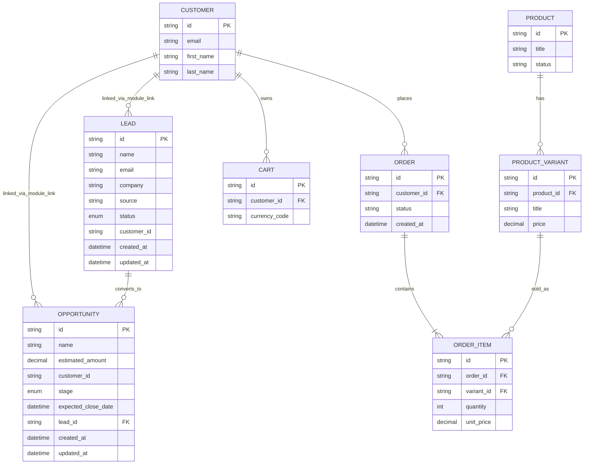

# 026.artstore 系统使用说明书（Medusa + Storefront + Strapi + CRM）

## 1. 文档目的
本手册用于指导你在本项目中完成以下工作：

- 本地环境初始化与启动（PowerShell）
- 日常开发与联调
- 管理后台和内容后台的使用
- CRM（Lead/Opportunity）功能使用
- 数据库实体关系（ER）理解
- 常见故障排查

---

## 2. 系统总览

### 2.1 技术栈
- 后端电商核心：Medusa v2.13.1（Node.js + TypeScript）
- 前端商城：Next.js（`apps/storefront`）
- CMS：Strapi（`apps/strapi`）
- 数据库：PostgreSQL
- 缓存/队列：Redis

### 2.2 Monorepo 结构
- `apps/medusa`：订单、商品、购物车、客户、CRM 等服务
- `apps/storefront`：前台站点
- `apps/strapi`：CMS 内容管理
- `docker-compose.yml`：Postgres/Redis 基础设施

### 2.3 本地默认端口
- Storefront：`http://localhost:3000`
- Strapi：admin `http://localhost:1337`
- Medusa：admin `http://localhost:9000/app`
- Medusa API：`http://localhost:9000`

---

## 3. 环境准备（PowerShell）

## 3.1 依赖要求
- Node.js 20+
- npm 10+
- Docker Desktop

## 3.2 安装依赖
```powershell
cd D:\work\project\026.artstore\www
npm install
npm --prefix apps/storefront install
```

## 3.3 启动基础设施
```powershell
cd D:\work\project\026.artstore\www
npm run infra:up
```

## 3.4 一键启动全部服务
```powershell
cd D:\work\project\026.artstore\www
npm run dev:all
```

如果需要清理后重启：
```powershell
cd D:\work\project\026.artstore\www
npm run dev:all:clean
```

---

## 4. 分服务启动（PowerShell）

## 4.1 Medusa
```powershell
cd D:\work\project\026.artstore\www
npm run dev:medusa
```

## 4.2 Strapi
```powershell
cd D:\work\project\026.artstore\www
npm run dev:strapi
```

## 4.3 Storefront
```powershell
cd D:\work\project\026.artstore\www
npm run dev:storefront
```

---

## 5. 首次初始化与账号

## 5.1 Medusa 管理员
```powershell
cd D:\work\project\026.artstore\www\apps\medusa
npx medusa user -e admin2@local.dev -p Admin123456
```

登录地址：`http://localhost:9000/app`

## 5.2 Publishable Key（供 Storefront）
```powershell
cd D:\work\project\026.artstore\www\apps\medusa
npx medusa exec ./src/scripts/create-publishable-key.ts
```
然后把 key 配到 `apps/storefront/.env.local` 的 `NEXT_PUBLIC_MEDUSA_PUBLISHABLE_KEY`。

## 5.3 CRM 模块迁移（首次）
```powershell
cd D:\work\project\026.artstore\www\apps\medusa
npx medusa db:generate crm
npx medusa db:migrate
```

---

## 6. 核心业务流程

## 6.1 电商主流程
1. 用户浏览商品（Storefront）。
2. 加入购物车并结算。
3. Medusa 处理订单、库存、支付与客户。
4. 管理员在 Medusa Admin 查看订单。

## 6.2 内容流程（Strapi）
1. 运营在 Strapi 创建/维护内容。
2. Storefront 拉取内容并渲染展示。

## 6.3 CRM 流程（已接入）
1. 创建 Lead（潜在客户）。
2. 跟进 Lead 状态：`new/contacted/qualified/lost`。
3. 将 Lead 转化为 Opportunity（商机）。
4. Opportunity 阶段流转：`prospecting/negotiation/closed_won/closed_lost`。

---

## 7. CRM 功能说明

## 7.1 数据模型

### Lead
- `id`
- `name`
- `email`
- `company`
- `source`
- `status`（`new | contacted | qualified | lost`）
- `customer_id`（可选）

### Opportunity
- `id`
- `name`
- `estimated_amount`
- `customer_id`
- `stage`（`prospecting | negotiation | closed_won | closed_lost`）
- `expected_close_date`（可选）
- `lead_id`（可选）

### 与 Customer 的关系
CRM 使用 Medusa v2 的 **Module Link** 与原生 Customer 建立关联（而非跨模块强耦合外键）。

---

## 8. CRM API 使用（PowerShell）

以下示例用于本地联调。若你的 Admin API 已启用鉴权，请在请求头加 Bearer Token。

## 8.1 创建 Lead
接口：`POST /admin/crm/leads`

```powershell
$body = @{
  name = "Alice Zhang"
  email = "alice@example.com"
  company = "Acme Pty Ltd"
  source = "website"
  status = "new"
} | ConvertTo-Json

Invoke-RestMethod -Method Post `
  -Uri "http://localhost:9000/admin/crm/leads" `
  -ContentType "application/json" `
  -Body $body
```

## 8.2 查询 Lead 列表
接口：`GET /admin/crm/leads`

```powershell
Invoke-RestMethod -Method Get -Uri "http://localhost:9000/admin/crm/leads"
```

## 8.3 Lead 转 Opportunity
接口：`POST /admin/crm/leads/{lead_id}/convert`

```powershell
$leadId = "lead_xxx"

$body = @{
  name = "Acme 2026 Annual Contract"
  estimated_amount = 120000
  customer_id = "cus_xxx"
  stage = "prospecting"
  expected_close_date = "2026-06-30"
} | ConvertTo-Json

Invoke-RestMethod -Method Post `
  -Uri "http://localhost:9000/admin/crm/leads/$leadId/convert" `
  -ContentType "application/json" `
  -Body $body
```

---

## 9. 数据库 ER 图（核心逻辑）

说明：下图是“业务核心实体关系图”，用于理解系统，不等同于 Medusa 全量物理表。



## 9.1 导出真实数据库结构（PowerShell）
如果你要“物理级 ER 图”（和当前数据库 100% 对齐），先导出 schema：

```powershell
Invoke-RestMethod -Method Get -Uri "http://localhost:9000/admin/schema" `
  | ConvertTo-Json -Depth 10 `
  | Out-File -FilePath ".\medusa-schema.json" -Encoding utf8
```

然后可把 `medusa-schema.json` 导入你的建模工具（如 dbdiagram、DBeaver、DataGrip）自动生成完整 ER 图。

---

## 10. 管理后台操作指引

## 10.1 Medusa Admin
- 地址：`http://localhost:9000/app`
- 常见操作：商品、库存、订单、客户管理
- CRM：通过自定义 Admin API + 前端/脚本调用维护 Lead 与 Opportunity

## 10.2 Strapi Admin
- 地址：`http://localhost:1337`
- 常见操作：内容模型管理、文章/页面内容发布

---

## 11. 运维与排障

## 11.1 常用命令（PowerShell）
查看容器状态：
```powershell
docker ps
```

停止基础设施：
```powershell
cd D:\work\project\026.artstore\www
npm run infra:down
```

## 11.2 常见问题
1. Medusa 启动但接口不可用
- 检查 Postgres/Redis 是否已启动。
- 检查 `apps/medusa/.env` 的 `DATABASE_URL` / `REDIS_URL`。

2. Storefront 无法下单
- 检查 `apps/storefront/.env.local` 中 `MEDUSA_BACKEND_URL`、publishable key。

3. CRM 表不存在
- 未执行迁移：
  - `npx medusa db:generate crm`
  - `npx medusa db:migrate`

4. 500 错误（CRM convert）
- 检查 `lead_id`、`customer_id` 是否存在。
- 检查请求体字段类型，尤其 `estimated_amount` 和日期格式。

---

## 12. 建议的后续完善
1. 为 CRM 路由增加统一的鉴权中间件与 RBAC。
2. 补齐 Opportunity 的完整 CRUD API。
3. 增加 CRM 事件订阅（例如：Lead 转化后通知销售）。
4. 把 ER 图拆成“逻辑图 + 物理图（基于实际数据库导出）”。
